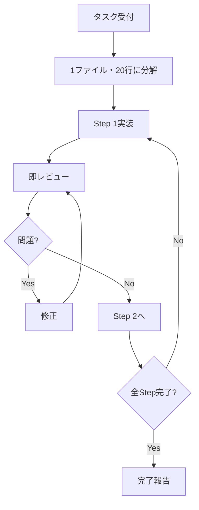

# @micro-step コマンド

## 概要
1ファイル・20行以内のマイクロステップで実装→レビュー→修正のサイクルを自動化します。

## 使用方法
```bash
@micro-step "実装したい内容"
```

## 実行フロー


## 内部処理

### 1. タスク分解（自動）
```markdown
入力：「ユーザー認証機能を追加」
↓
Step 1: models/user.py - passwordフィールド追加（5行）
Step 2: models/user.py - set_passwordメソッド（15行）
Step 3: models/user.py - check_passwordメソッド（10行）
Step 4: serializers/auth.py - LoginSerializer作成（20行）
...
```

### 2. 各Stepの自動実行
```bash
# Step実装
@executor "Step Xを実装（1ファイル・20行以内）"

# 即レビュー（30秒以内）
@reviewer "直前の変更をクイックレビュー"

# 問題があれば即修正
if [問題あり]; then
  @executor "レビュー指摘を修正"
fi
```

### 3. 進捗の自動記録
- `docs/micro-steps/step_XXX.md` - 各ステップの記録
- `docs/micro-steps/progress.md` - 全体進捗

## オプション

### --dry-run
実行計画のみ表示
```bash
@micro-step --dry-run "タスク"
```

### --max-lines
1ステップの最大行数（デフォルト: 20）
```bash
@micro-step --max-lines 10 "タスク"
```

### --auto-commit
各ステップ後に自動コミット
```bash
@micro-step --auto-commit "タスク"
```

## 実装例

### シンプルな使用
```bash
@micro-step "UserモデルにemailフィールドとバリデーションRule２０行ずつ"
```

### 詳細な制御
```bash
@micro-step \
  --max-lines 15 \
  --auto-commit \
  --review-level strict \
  "APIエンドポイント/api/users/を追加"
```

## 出力例
```
🚀 マイクロステップ実行開始
━━━━━━━━━━━━━━━━━━━━━━━━━━━━
📝 Step 1/5: models/user.py - emailフィールド追加
  ✅ 実装完了（12行）
  ✅ レビュー合格
  
📝 Step 2/5: models/user.py - email検証メソッド
  ✅ 実装完了（18行）
  ⚠️  レビュー指摘: 正規表現の改善
  🔧 修正中...
  ✅ 修正完了
  ✅ レビュー合格
  
📝 Step 3/5: serializers/user.py - EmailSerializer
  ✅ 実装完了（20行）
  ✅ レビュー合格
  
━━━━━━━━━━━━━━━━━━━━━━━━━━━━
✨ 全ステップ完了！
- 実装: 5 steps
- レビュー修正: 1 回
- 総変更行数: 75行
```

## エラーハンドリング

### 20行を超えた場合
```
❌ エラー: Step 3が25行になりました
🔄 自動分割中...
  Step 3a: 最初の15行
  Step 3b: 残りの10行
```

### レビュー失敗が続く場合
```
❌ エラー: 3回連続でレビュー失敗
🤔 より詳細な指示が必要です
> どのように修正すべきですか？
```

## 設定ファイル
`.claude/config/micro-step.yaml`
```yaml
micro_step:
  max_lines_per_step: 20
  auto_review: true
  review_timeout: 30
  auto_commit_interval: 5
  strict_mode: true
```