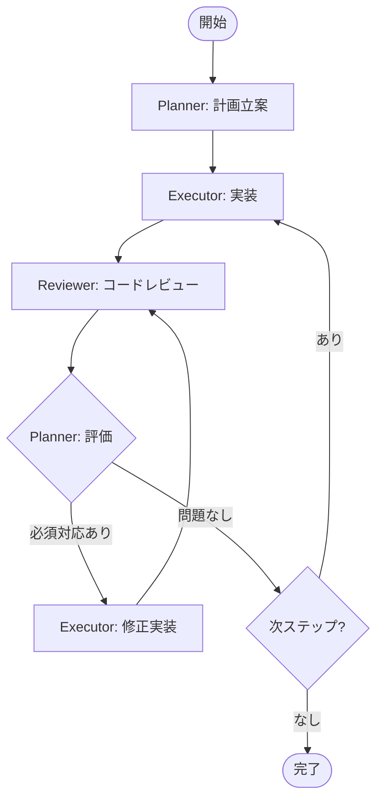

# Agent連携ワークフロー

## 概要
3つのエージェント（Planner、Executor、Reviewer）が協力して高品質なコード実装を実現します。

## エージェント役割

### 🟢 @planner (計画者)
- タスクを小さな実行単位に分割
- 実装結果とレビュー結果の評価
- 次ステップの明確化
- 改善タスクの計画への統合

### 🔵 @executor (実装者)
- 計画に基づいた確実な実装
- 1〜3ファイルの小さい単位での作業
- テスト実行と結果記録
- 問題点の明確な報告

### 🟣 @reviewer (レビュワー)
- 実装コードの品質評価
- セキュリティ・パフォーマンス・品質チェック
- 改善提案の優先順位付け
- 知識の蓄積と共有

## ワークフロー図



## ファイル構造

```
docs/
├── context/               # 共有コンテキスト
│   ├── plan.md           # 実行計画
│   ├── status.md         # 進捗ステータス
│   └── improvement_tasks.md  # 改善タスクリスト
├── results/              # 実装結果
│   ├── step_001.md       # 各ステップの結果
│   └── step_001_error.md # エラー詳細（必要時）
├── reviews/              # レビュー結果
│   └── step_001_review.md # 各ステップのレビュー
└── code-reviews/         # 知識蓄積
    └── patterns.md       # よくある問題と解決策
```

## 実行フロー詳細

### 1. 初回計画
```bash
@planner "機能Xを実装。5ステップ以内で計画作成"
```
→ `docs/context/plan.md`に計画を保存

### 2. 実装実行
```bash
@executor "docs/context/plan.mdのStep 001を実装"
```
→ `docs/results/step_001.md`に結果を記録

### 3. コードレビュー
```bash
@reviewer "docs/results/step_001.mdの実装をレビュー"
```
→ `docs/reviews/step_001_review.md`にレビュー結果
→ `docs/context/improvement_tasks.md`に改善タスク

### 4. 計画更新
```bash
@planner "レビュー結果を確認し、計画を更新"
```
→ 必須対応を次ステップに組み込み
→ `docs/context/plan.md`を更新

## レビュー結果の優先順位

### 🔴 必須対応
- セキュリティ脆弱性
- 重大なバグ
- データ破損リスク
→ **即座に修正ステップを追加**

### 🟡 推奨対応
- パフォーマンス改善
- コード品質向上
- テスト追加
→ **適切な位置に組み込み**

### 🔵 任意対応
- リファクタリング提案
- 将来の拡張性
→ **時間があれば実施**

## ベストプラクティス

### ステップの粒度
- 変更ファイル：1〜3個まで
- コード変更：50行以内推奨（最大100行）
- 実行時間：3分以内推奨（最大5分）

### 情報共有
- すべての情報は`docs/`ディレクトリで共有
- 各エージェントは必要なファイルを読み込んで作業
- 結果は必ず所定の場所に記録

### 品質保証
- Executorの実装後は必ずReviewerがチェック
- 必須対応項目は修正完了まで次に進まない
- 知識は蓄積して将来の実装に活用

## トラブルシューティング

### ステップが大きすぎる場合
- Plannerに分割を依頼
- 1〜3ファイルの単位に細分化

### レビューで重大な問題が見つかった場合
- 即座に修正ステップを追加
- 元の計画は一時停止
- 修正完了後に継続

### 実装がブロックされた場合
- エラー詳細を記録
- Plannerに相談して計画を調整