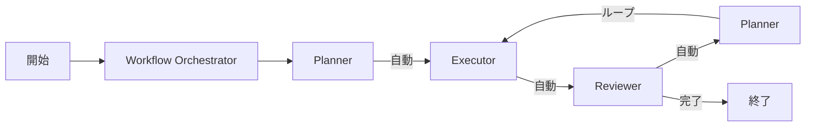

# 🔄 ワークフローオーケストレーション改善ガイド

## 📋 概要
このドキュメントは、Claude Codeのサブエージェント間のワークフロー連携を改善するために実装された機能について説明します。

## 🎯 改善の目的
- エージェント間の自動連携を実現
- コンテキストの確実な受け渡し
- ワークフローの可視化と追跡
- 手動介入の最小化

## 🏗️ 実装された機能

### 1. **Workflow Orchestrator（中央制御）**
- **ファイル**: `.claude/agents/workflow_orchestrator.md`
- **役割**: すべてのエージェントを管理し、適切な順序で呼び出す
- **特徴**:
  - 状態管理（workflow_state.json）
  - 自動的な次エージェント呼び出し
  - エラーハンドリングとリトライ

### 2. **Step Flowコマンド**
- **ファイル**: `.claude/commands/step_flow.md`
- **使用方法**:
  ```bash
  /step_flow start "タスクの説明"  # 新規開始
  /step_flow resume                  # 継続
  /step_flow status                  # 状態確認
  ```

### 3. **状態管理システム**
- **ファイル**: `docs/context/workflow_state.json`
- **内容**:
  - 現在のフェーズ（planning/executing/reviewing）
  - 現在のステップ
  - 実行履歴
  - 次のアクション

### 4. **エージェント間連携**
各エージェントに追加された機能：

#### Planner（計画）
- 計画完了後、自動的にExecutorを呼び出し
- レビュー結果を受け取って次の計画を作成

#### Executor（実装）
- 実装完了後、自動的にReviewerを呼び出し
- エラー時はPlannerにエスカレーション

#### Reviewer（レビュー）
- レビュー完了後、自動的にPlannerを呼び出し
- 優先度に応じた自動判断

### 5. **フック強化**
- **ファイル**: `.claude/settings.json`
- **機能**:
  - ファイル作成検出による自動呼び出し提案
  - 現在の状態表示
  - 次のアクション提示

## 🔄 ワークフローの流れ



## 📊 ファイル構造

```
.claude/
├── agents/
│   ├── planner.md          # 計画エージェント（連携機能追加済み）
│   ├── executor.md         # 実装エージェント（連携機能追加済み）
│   ├── reviewer.md         # レビューエージェント（連携機能追加済み）
│   └── workflow_orchestrator.md  # 新規：オーケストレーター
├── commands/
│   └── step_flow.md        # 新規：ワークフローコマンド
└── settings.json           # フック強化済み

docs/
└── context/
    ├── workflow_state.json # 新規：状態管理
    ├── handoff.json       # 新規：エージェント間受け渡し
    ├── plan.md            # 計画書
    ├── current_step.md    # 現在のステップ
    └── improvement_tasks.md # 改善タスク
```

## 🚀 使用開始方法

### 1. 新規タスクの開始
```bash
/step_flow start "ユーザー認証機能を実装"
```

### 2. 既存ワークフローの継続
```bash
/step_flow resume
```

### 3. 進捗確認
```bash
/step_flow status
```

## ⚡ 自動化のポイント

### コンテキスト受け渡し
- `handoff.json`でエージェント間のデータを標準化
- 各エージェントは前のエージェントの出力を自動読み込み

### 状態管理
- `workflow_state.json`で現在位置を追跡
- 中断からの自動復帰が可能

### エラーハンドリング
- 自動リトライ（最大3回）
- 重大エラー時の自動エスカレーション

## 🔍 トラブルシューティング

### エージェントが呼び出されない場合
1. `workflow_state.json`の`current_phase`を確認
2. `handoff.json`の`to`フィールドを確認
3. フックが正しく動作しているか確認

### ループに陥った場合
1. `workflow_state.json`の履歴を確認
2. 同じステップが繰り返されていないか確認
3. 必要に応じて手動で次のフェーズに進める

### ファイルが見つからない場合
1. `docs/`ディレクトリ構造を確認
2. 必要なファイルを手動作成
3. `/step_flow resume`で再開

## 📝 ベストプラクティス

### 1. 明確なタスク定義
- 初回のタスク説明は詳細に
- 成功条件を明確に定義

### 2. 小さなステップ
- 1ステップ = 1ファイル・20行以内
- 頻繁なチェックポイント

### 3. 継続的な監視
- `/step_flow status`で定期的に確認
- ログファイルの確認

## 🎯 期待される効果

### Before（改善前）
- 手動でエージェントを順次呼び出し
- コンテキストが失われやすい
- どのエージェントを次に呼ぶか不明確

### After（改善後）
- 自動的な連続実行
- コンテキストの確実な受け渡し
- 明確なワークフロー進行

## 🔄 今後の改善案

1. **並列実行**
   - 独立したステップの並列実行
   - リソース競合の自動調整

2. **AI判断の強化**
   - より高度な自動判断
   - 学習による最適化

3. **可視化**
   - リアルタイムの進捗表示
   - ガントチャート生成

## 📚 関連ドキュメント
- [Claude Flow Wiki](https://github.com/ruvnet/claude-flow/wiki/Workflow-Orchestration)
- [Claude Code Best Practices](https://www.anthropic.com/engineering/claude-code-best-practices)
- [Agent Orchestration Patterns](https://www.youtube.com/watch?v=mEt-i8FunG8)